# Earthquake Prevention Analysis

## Project Overview
This project automates the process of fetching, cleaning, and analyzing earthquake data. The pipeline scrapes earthquake data from an API, processes it, and stores it in PostgreSQL using Apache Airflow.
---

## Technologies Used
- **Python**: For web scraping and data cleaning.
- **Apache Airflow**: For orchestrating the ETL workflow.
- **Docker Compose**: To containerize the application.
- **PostgreSQL**: For storing the processed data.
- **PgAdmin**: For interacting with PostgreSQL.

---

## Setup Instructions

### 1. Clone the Repository
Clone the project repository and navigate to the directory:

```bash
git clone https://github.com/shaik-1036/Earthquake_Prevention_analysis.git
```

### 2. Install Dependencies
Install Python and required libraries like Pandas and Requests for the project.
Ensure Docker and Docker Compose are installed on your system.

### 3. Docker Setup
Use Docker Compose to set up all necessary services:
- **PostgreSQL**: For storing the processed data.
- **PgAdmin**: For managing the PostgreSQL database.
- **Apache Airflow**: For scheduling the data pipeline.

Run the following command in your terminal or project directory:

```bash
docker-compose up 
```

This will initialize:
- **PostgreSQL** at `localhost:5432`
- **PgAdmin** at `localhost:5050`
- **Airflow** at `localhost:8080`

#### Login Credentials:
- **Airflow**: `http://localhost:8080`
  - Username: `airflow`
  - Password: `airflow`
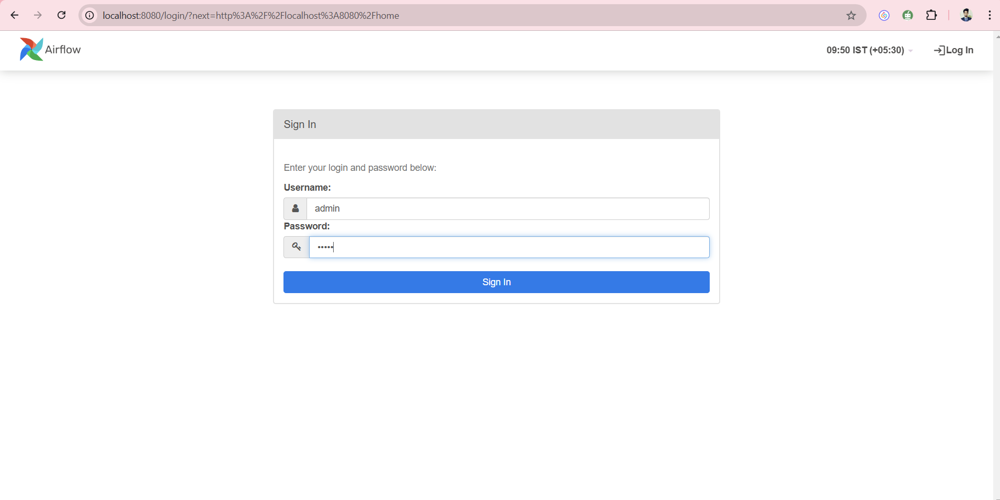
- **PgAdmin**: `http://localhost:5050`
  - Set up your credentials in the UI.


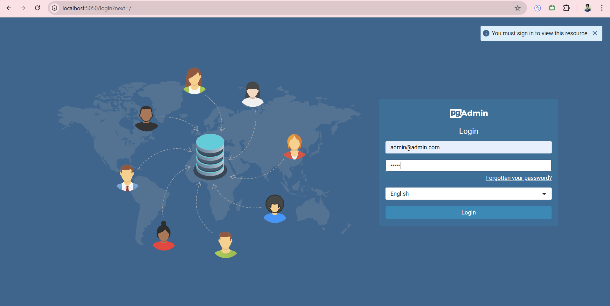

---

### 4. Configure PostgreSQL with PgAdmin
#### Step 1: Login to PgAdmin and Create a New Server

1. Click on **New Server** in PgAdmin.
   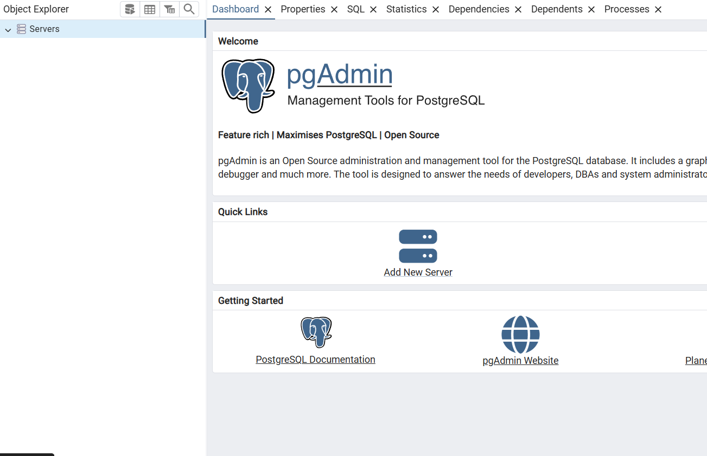
2. Enter the following details:
   - **Server Name**: `Airflow`
   - Click on the **Connection** tab and enter:
     - **Host Name**: *Container IP Address*
     - **Port**: `5432`
     - **Maintenance Database**: `Postgres`
     - **Username**: `airflow`
     - **Password**: `airflow`

3. Click **Save**.

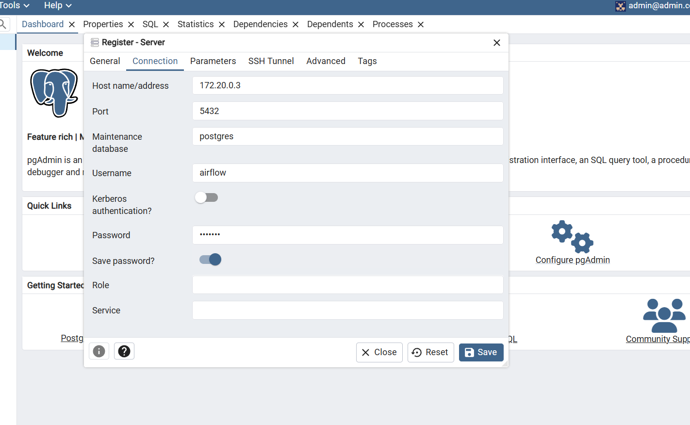

#### Step 2: Find Host Address for PostgreSQL
To find the PostgreSQL container's IP address:

1. List running containers:
   ```bash
   docker ps
   ```
   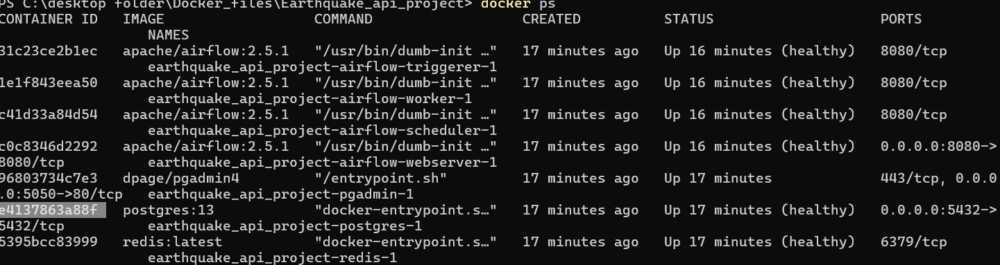

2. Inspect the PostgreSQL container:
   ```bash
   docker inspect <container_id>
   ```
   This will return the container details, including the IP address.
   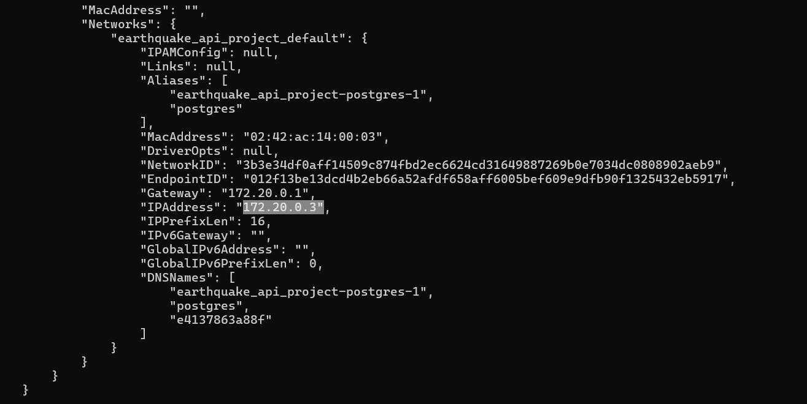

3. Copy and paste the IP address into the **Host Address** field in PgAdmin.

---

### 5. Airflow DAGs Configuration
The pipeline logic is defined in the `Earth_quake_api.py` file inside the `dags/` directory. This script automates:
- Fetching data from the API & Transform the data .
- Create a table in Postgres Database .
- Inserting processed data into PostgreSQL.

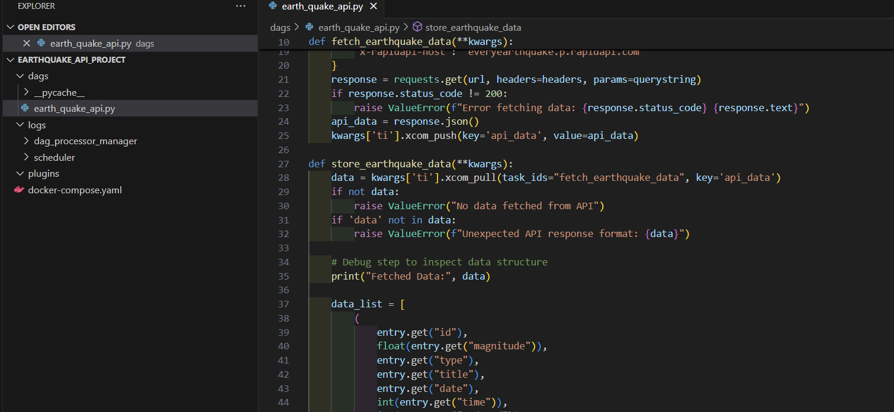

---

## Running the Pipeline

### 6.1 Accessing the Airflow Web UI
Once services are running, access Airflow at `http://localhost:8080`.

#### Login Credentials:
- **Username**: `airflow`
- **Password**: `airflow`

---

### 6.2 Setting Up PostgreSQL Connection in Airflow
To allow Airflow to communicate with PostgreSQL:

1. Go to **Admin > Connections** in Airflow.
2. Click **+** to create a new connection.
3. Enter the following details:
   - **Conn ID**: `postgres_default`
   - **Conn Type**: `Postgres`
   - **Host**: `postgres` (Docker service name)
   - **Schema**: `airflow`
   - **Login**: `airflow`
   - **Password**: `airflow`
   - **Port**: `5432`
4. Click **Test Connection** and then **Save**.

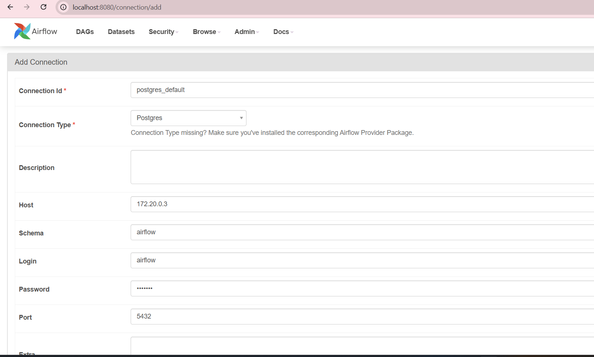

---

### 6.3 Activating the DAG
1. In the Airflow UI, navigate to the **DAGs** tab.
2. Locate `fetch_earth_quake_data`.
   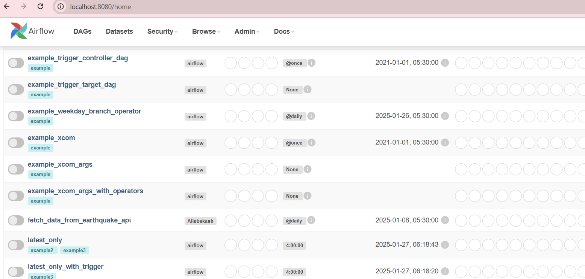
3. Toggle it **On** to activate.

#### Steps Executed by the DAG:
1. Fetch data from the API.
2. Transform and clean data.
3. Store processed data in PostgreSQL.

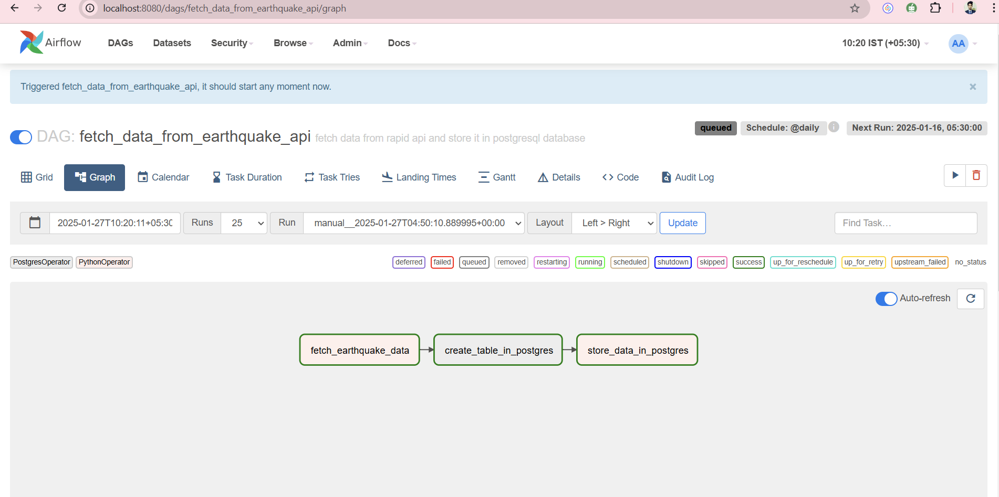

---

### 6.4 Accessing PostgreSQL Database

#### Using PgAdmin:
1. Open **pgAdmin** and connect to the database.
2. Run queries to view the earthquake data:
   ```sql
   SELECT * FROM Earth_quake_data_api;
   ```
   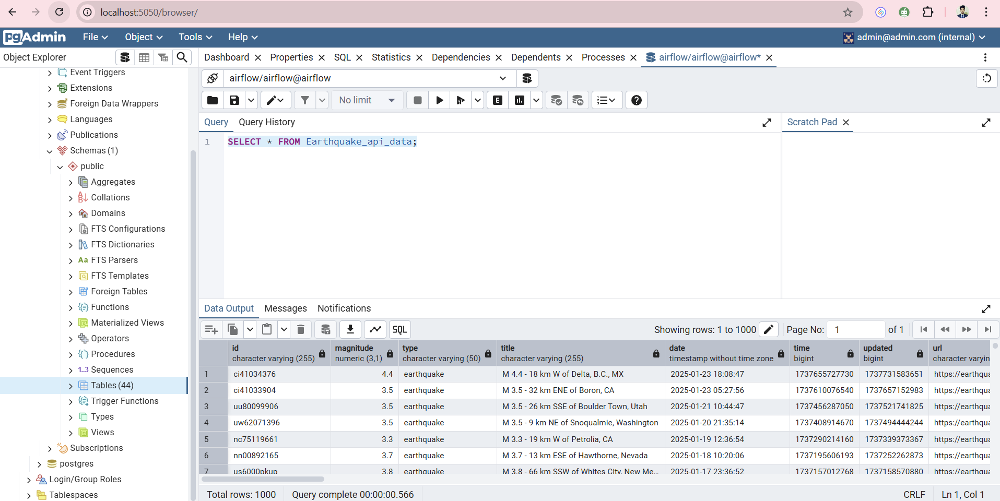

#### Using Terminal (`psql`):
1. Connect to the PostgreSQL database:
   ```bash
   psql -h localhost -U airflow -d airflow
   ```
2. Run SQL queries:
   ```sql
   SELECT * FROM Earth_quake_data_api;
   ```

---

## Future Improvements
- Implement error handling for failed API requests.
- Automate scheduled data fetching.
- Explore advanced data transformation techniques.
- Deploy the pipeline on cloud platforms like AWS or Azure.

---

## Conclusion
This project demonstrates a full ETL pipeline for earthquake data using Apache Airflow and PostgreSQL. The setup ensures automated data fetching, processing, and storage, making it easier to analyze earthquake trends.

